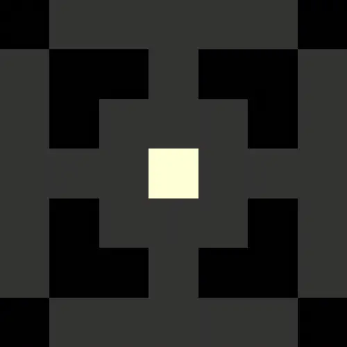

**GPU-powered flow field generation for Unity DOTS**


## Overview

**NativeFlowField** is a high-performance Unity library for generating 2D navigation flow fields on the GPU using compute shaders and native collections. It is intended for DOTS-based projects that require scalable, low-latency navigation data suitable for thousands of agents operating in dynamic environments.

Unlike traditional A* pathfinding, flow fields (sometimes called [Dijkstra Maps](https://www.roguebasin.com/index.php/Dijkstra_Maps_Visualized)) allow multiple agents to navigate towards a shared target without making individual pathfinding requests. That makes flow fields ideal for crowd simulation, RTS unit movement and swarm behavior.

This implementation offloads flow field computation entirely to the GPU, enabling real-time responsiveness to dynamic obstacles and moving targets without sacrificing performance.

## Installation

Open the Package Manager, click _+_ and select _Install package from git URL..._

`https://github.com/kingstone426/NativeFlowField.git`


## Sample Project

For a complete sample project, check out the [NativeFlowFieldDemo](https://github.com/kingstone426/NativeFlowFieldDemo).

## Usage

### Step 1: Create a NativeFlowField

Let's create a tiny 7x7 flow field with a heatmap for visualizion

```
var flowField = new NativeFlowField(width: 7, height: 7, generateHeatMap: true);
```

### Step 2: Create an input field


The input field contains the map data that will be baked.

```
var inputField = new NativeArray<float>(7 * 7, Allocator.Persistent);
```

Each element represents a cell that can be either Walkable, Obstacle or Target.

Let's populate the input field with some map data.

```
float W = float.MinValue;   // Walkable
float O = float.MaxValue;   // Obstacle
float T = 0;                // Target

NativeArray<float>.Copy(new float[]
{
    O, W, W, W, W, W, O,
    W, O, O, W, O, O, W,
    W, O, W, W, W, O, W,
    W, W, W, T, W, W, W,
    W, O, W, W, W, O, W,
    W, O, O, W, O, O, W,
    O, W, W, W, W, W, O,
}, inputField);
```

It is possible to mark multiple cells as targets and (optionally) give them different priority. A value of zero represents default priority, while positive numbers have lower priority and negative numbers have higher priority.

### Step 3: Bake the Flow Field



The Bake method dispatches compute shader passes that propagate the distance field step-by-step outwards from the Target.

```
flowField.Bake(inputField);
```

> [!NOTE]  
> The Bake method returns a `AsyncGPUReadbackRequest`, which you can poll or wait for if blocking behavior is needed (e.g., during testing). For real-time applications, however, it is recommended that you recreate the input field and call `Bake` every frame (or whenever the terrain has been updated).
>

### Step 3: Move across the Flow Field


Once the GPU has finished baking the input field, the resulting flow field can be accessed from the `NextIndices` array where each element points to the adjacent cell with the lowest distance to target. This makes navigating towards the target as simple as following the indices of the array.

```
int2 GetNextCell(int2 cell)
{
  int cellIndex = cell.x + cell.y * flowField.Width;
  cellIndex = flowField.NextIndices[cellIndex];
  cell.x = cellIndex % flowField.Width;
  cell.y = cellIndex / flowField.Width;
  return cell;
}
```

If the Target has been reached, `cellIndex` will not change so the agent stops.

> [!NOTE]
> To access `NextIndices` in Burst compiled jobs, you need to use unsafe pointers as a [workaround for a known bug](https://discussions.unity.com/t/asyncgpureadback-requestintonativearray-causes-invalidoperationexception-on-nativearray/818225/76) with `AsyncGPUReadback.RequestIntoNativeArray`.
>

### Step 4: Clean Up
Remember to dispose all native resources when done:

```
inputField.Dispose();
flowField.Dispose();
```

## Limitations

#### 2D Grid Topology

Currently, `NativeFlowField` only supports 2D uniform grid layouts. This covers most RTS, tower defense, and crowd simulation scenarios. However, support for 3D grids or general graph structures could be implemented in the future.

#### Async Compute

Although `NativeFlowField` was designed with Unity’s async compute pipeline in mind, in practice the compute workload still impacts the render thread, especially for large iteration counts. As a workaround, `BakeOptions.IterationsPerFrame` allows compute workloads to be spread across multiple frames, avoiding large frame spikes and helping maintain a consistent framerate.

## Contributing

Contributions are welcome!

Feel free to fork the repository, open issues, submit pull requests, or share suggestions. This is a hobby project and provided as-is to the community — I may not have time to actively maintain it or respond to bug reports, but I appreciate any effort to improve or build upon it.

If you find it useful and make improvements, I encourage you to share them!