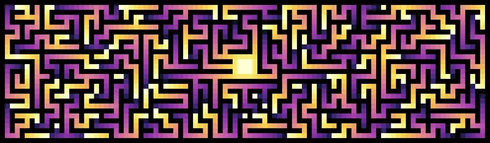

**GPU-powered flow field generation for Unity DOTS**



## Overview

**NativeFlowField** is a high-performance Unity library for generating 2D navigation flow fields on the GPU using compute shaders and native collections. It is intended for DOTS-based projects that require scalable, low-latency navigation data suitable for thousands of agents operating in dynamic environments.

Unlike traditional A* pathfinding, flow fields allow multiple agents to navigate towards a shared target without making individual pathfinding requests. That makes flow fields ideal for crowd simulation, RTS unit movement and swarm behavior.

This implementation offloads flow field computation entirely to the GPU, enabling real-time responsiveness to dynamic obstacles and moving targets without sacrificing performance.

## Installation

Add the following line to the _dependencies_ section of your _packages.json_:

`"com.kingstone426.nativeflowfield": "https://github.com/kingstone426/NativeFlowField.git"`

Alternatively, open the Package Manager, click the _+_ and select _Install package from git URL..._

`https://github.com/kingstone426/NativeFlowField.git`

## Usage

For a complete sample project, check out the [NativeFlowFieldTestProject](https://github.com/kingstone426/NativeFlowFieldTestProject).

<table>
  <tr>
    <td align="center">Input field</td>
    <td align="center">Field propagation</td>
    <td align="center">Flow field</td>
  </tr>
</table>

### Step 1: Create a NativeFlowField

```
// Let's create a tiny 8x8 flow field with a heatmap for visualizion
var flowField = new NativeFlowField(width: 8, height: 8, generateHeatMap: true);

// Enable 8-direction movement
flowField.DiagonalMovement = true;
```

### Step 2: Create an input field

The input field contains the map data that will be baked. Each element represents a tile that can be either Walkable, Obstacle or Target.

It is possible to mark multiple tiles as targets and (optionally) give them different priority. A value of zero represents default priority, while positive numbers have lower priority and negative numbers have higher priority.


```
// Make sure the input field is the same size as the flow field
var inputField = new NativeArray<float>(8 * 8, Allocator.Persistent);

float W = float.MinValue;   // Walkable
float O = float.MaxValue;   // Obstacle
float T = 0;                // Target

// Let's populate the input field with some map data
NativeArray<float>.Copy(new float[]
{
    O, O, O, O, O, O, O, O,
    O, W, W, W, W, W, W, O,
    O, W, T, W, O, O, W, O,
    O, O, O, W, O, W, W, O,
    O, W, W, W, O, W, O, O,
    O, W, O, O, O, W, W, O,
    O, W, W, W, W, W, W, O,
    O, O, O, O, O, O, O, O,
}, inputField);
```

### Step 3: Bake the Flow Field

```
flowField.Bake(inputField);
```

The Bake method dispatches compute shader passes that propagates the distance field step-by-step outwards from the Target.

> [!NOTE]  
> The Bake method returns a `AsyncGPUReadbackRequest`, which you can poll or wait for if blocking behavior is needed (e.g., during testing). For real-time applications, however, it is recommended that you recreate the input field and call `Bake` each frame (or whenever the terrain has been updated).
>

### Step 3: Use the Result

Once the GPU has finished baking the input field, the resulting flow field can be accessed from the `NextIndices` property. `NextIndices` is a `NativeArray<int>` where each element holds the index of the adjacent tile with the lowest distance to target. This makes navigating towards the target as simple as following the indices of the array.

Here is an example of a job that helps agents navigate towards targets:

```
[BurstCompile]
private unsafe partial struct NavigationJob : IJobEntity
{
    [ReadOnly]
    [NativeDisableUnsafePtrRestriction] 
    public int* FlowField;
    
    public int Width;

    private void Execute(ref LocalTransform transform, in Agent _)
    {
        // Calculate the current tile from the transform position
        int2 currentTile = (int2)math.round(transform.Position.xz);
        int currentTileIndex = currentTileIndex.x + currentTileIndex.y * Width;
    
        // Traverse to the next tile
        // If the Target has been reached, nextTileIndex will equal currentTileIndex
        int newTileIndex = FlowField[currentTileIndex];
    
        // Update transform position to new tile
        transform.Position.x = newTileIndex % Width;
        transform.Position.y = (int)(newTileIndex / Width);
    }
}
```

Schedule the `NavigationJob` from a system and watch the agents "flow" towards the target.

```
Dependency = new NavigationJob
{
    FlowField = (int*)flowField.NextIndices.GetUnsafeReadOnlyPtr(),
    Width = 8
}.ScheduleParallel(Dependency);
```

> [!NOTE]
> The `unsafe` pointers are used as a workaround for a known [bug](https://discussions.unity.com/t/asyncgpureadback-requestintonativearray-causes-invalidoperationexception-on-nativearray/818225/76) with `AsyncGPUReadback.RequestIntoNativeArray`.
>


### Step 4: Clean Up
Remember to dispose all native resources when done:

```
inputField.Dispose();
flowField.Dispose();
```

## Limitations

TBD

## Contributing

Contributions are welcome!

Feel free to fork the repository, open issues, submit pull requests, or share suggestions. This is a hobby project and provided as-is to the community — I may not have time to actively maintain it or respond to bug reports, but I appreciate any effort to improve or build upon it.

If you find it useful and make improvements, I encourage you to share them!